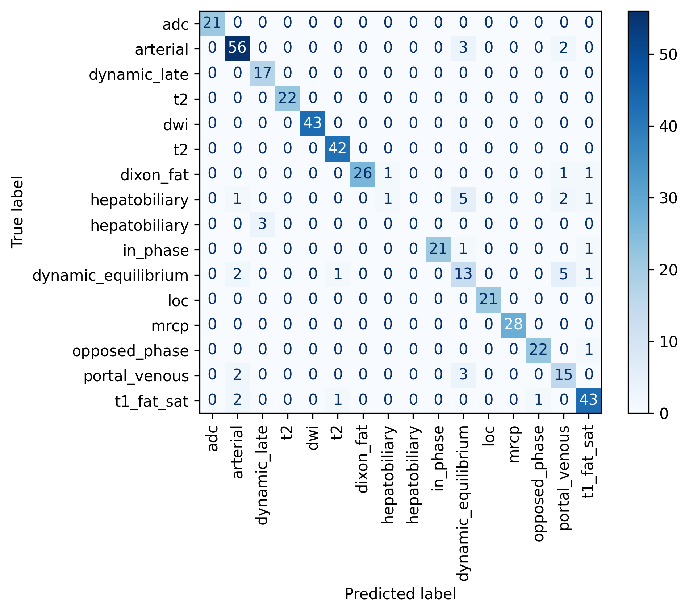

# Duke AIPI590-XAI Fall 2024 Final Project
## Chad Miller 

## Statement of Purpose
This project delivers an interactive Streamlit-based application that classifies abdominal MRI series using convolutional neural networks (CNNs) and integrates explainable AI (XAI) techniques for enhanced interpretability. The app enables users to explore MRI datasets, view model predictions, and generate visual explanations for the decisions made by the model. By utilizing LIME, Anchors, and SHAP, the application allows users to identify the most influential regions in an image, fostering transparency and trust in AI-assisted workflows.


## Background:
Typical abdominal MRI examinations are comprised of numerous imaging series, each containing several images and each with its own set of features that determines tissue contrast. These differences are largely due to differences in acquisition parameters; additionally, several imaging series performed after contrast administration have timing such that the series can be generally characterized as being from a particular phase of post contrast imaging (e.g., ‘arterial’, ‘portal venous’, ‘hepatobiliary phase’, or ‘delayed’). 

Accurate automated series identification of abdominal MRI series is important for applications such as display protocols (or “hanging” protocols) and advanced postprocessing workflows, including radiomics or machine learning. Current approaches, such as textual series descriptions, are often unreliable due to inconsistencies across vendors, protocols, or institutions. Pixel-based classifiers, while promising, can be computationally expensive and may lack sufficient accuracy, whereas metadata-based classifiers struggle to distinguish between series with identical acquisition parameters. 

Note that with respect to ‘hanging’ protocols in PACS, this is typically performed using rules-based processes using the series description text and/or parameter values (T1, T2 settings) and may have problems when encountering data with variation (such as for reviewing a non-Duke study, see Figure 1 below). When the hanging protocol fails and there are several empty panels, this requires that the Radiologist finds them which is less efficient, and may cause him/her to not identify series of images which could lead to missed or incorrect diagnoses. 

Figure 1: On top is a typical PACS display with the hanging protocol for a Duke study, and on the bottom is the hanging of a non-Duke study with several empty panels.

Duke study:

Outside study:


## Approach
This repository uses a CNN-based model, specifically a DenseNet121 architecture, fine-tuned to classify abdominal MRI series into one of 19 distinct classes. This pixel-based classifier processes a single representative image (typically the middle image) from each series to reduce computational overhead, similar to a previously published approach for brain MRI classification [2].

To enhance interpretability and provide insights into model predictions, explainable AI techniques such as LIME, Anchors, and SHAP have been integrated. These methods help users understand the reasoning behind the model’s decisions, improving trust and usability in clinical settings.


## Dataset:
The dataset is identical to that reported in [3] and contains scans from multiple vendors and field strengths, representative of typical clinical abdominal MRI examinations. The dataset includes:

* 2,215 MRI series from 105 subjects, with each subject having a single examination.
* Series manually labeled by three radiologists with 2–15 years of experience.
* A final dataset of 2,165 MRI series after eliminating research-only and uncommon (less than 10 samples) series, split into 80% training (1,733 series) and 20% testing (432 series).
* Each series includes a single representative image, typically the middle image, chosen to avoid artifacts often found at the beginning or end of a series.

## Methods and Results:
### Data Preparation
* A single representative image (the middle image) was selected from each series.
* Images were resized to 299 x 299 x 3 (converted from grayscale to RGB), normalized, and transformed for input to the DenseNet121 model.
* Data augmentation included resizing, center cropping, and optional color jitter, ensuring semantic consistency with anatomical features.
### Model Architectures
DenseNet121 with transfer learning using ImageNet weights, Adam optimizer, and a custom Focal Loss. 

### Results
Overall accuracy of 91% on the test dataset. The cofusion matrix is shown below:



## Explainable AI Techniques

### LIME (Local Interpretable Model-Agnostic Explanations)

LIME is used to interpret model predictions by identifying regions in the image that positively or negatively influence the predicted class.

How it Works:
* Perturbs the input image by modifying small parts (superpixels).
* Evaluates the model’s response to perturbed versions of the input image by slightly modifying regions (called superpixels). Fits a simple, interpretable surrogate model—often a linear decision boundary—to approximate the complex behavior of the original model in the local neighborhood of the prediction, as shown in the image below.
* Highlights regions that strongly support (green) or contradict (red) the model’s decision.

Use Case: In the demo, users can generate LIME explanations for individual images, providing visual insights into why the model assigned a particular series label.

Advantages:
* Provides visually intuitive superpixel-level explanations.
* Useful for validating whether the model’s predictions align with clinical expectations.


### Grad-CAM (Gradient-weighted Class Activation Mapping)
Grad-CAM provides a visual explanation of a model’s decision by highlighting the regions in an image that are most influential for a specific class prediction.

How it Works:

* Computes the gradients of the model's predicted class score with respect to the feature maps of a target convolutional layer.
* Uses these gradients to weigh the importance of the feature maps, emphasizing the regions that have the highest contribution to the model’s decision.
* Generates a heatmap that overlays on the input image, highlighting the areas the model focused on during prediction. Red regions indicate high importance (strong positive influence), while blue regions show low importance.

Use Case:

In the demo, users can generate Grad-CAM explanations to understand which parts of an image (e.g., specific anatomical regions in medical scans) were most influential in the model’s classification decision.

Advantages:

* Model-Specific Precision: Provides class-specific explanations, helping identify regions that contribute to the prediction of a specific label.
* Broad Applicability: Effective for any CNN-based model, making it ideal for tasks like medical image analysis where understanding the focus of the model is crucial.
* Real-Time Feedback: Fast to compute, allowing users to quickly generate visual explanations for multiple images.

Complementary Role with LIME:
While LIME explains predictions using localized perturbations and linear approximations, Grad-CAM focuses on the internal feature importance within the neural network. Together, they provide a comprehensive understanding of model behavior, balancing internal and external perspectives.

### Examples
For the first example, it is a portal venous phase image for which the entire series is incorrectly labeled by the model as an arterial phase series (which is very similar) and the inference for the individual image has label t2 with low confidence. 
[img](app/assets/pv_prediction_image.png)

For the Grad-CAM and LIME images, we can see that the regions contributing to the prediciton correspond to the left kidney and some lesions in the liver:
[img](app/assets/lime_gc_example_correlation.png)

For the next example, we have a t2 image which is correctly predicted. The Grad-CAM image appears to attend to the text annotation in the top left of the image. 
[img](app/assets/t2_prediction_image.png)
[img](app/assets/lime_gc_example_t2_marker.png)


## How to install and use the repository code

**Google Colab**

One way to view some EDA and the code involved in the LIME explanation is in the colab notebook at [mriseries_notebook.ipynb](app/notebooks/mriseries_notebook.ipynb).  But a better way is to run the demo below.


## Demo

The streamlit demo displays the ability to scroll through the images of an abdominal MRI examination to get the predicted series for the image, as well as to process an entire studey or group of studys within a folder, writing the labels into the DICOM metadata of the processed files. In order to run the streamlit demo, it is necessary to have the DICOM images of an abdominal MRI examination. The steps to take to run the demo are:

**1. Clone this repository**
```
git clone https://github.com/mille055/AIPI590-XAI.git

```
**2. Install requirements:**
cd into the directory Assignments/MRIseries
```
cd Assignments/MRIseries
pip install -r requirements.txt
```
**3. Change directory to the demo and run the application**
```
cd app
streamlit run demo.py
```
The streamlit demo app will allow one to view images from the sample batch of studies in the default folder in the left sidebar. These images may or may not have labels embedded into the DICOM tags from prior label processing (generally, the prediction will show over the top left aspect of the image if it has been previously processed). One use of the demo app is to select studies to process (one study/patient at a time). This will generate predictions and write them into the DICOM tags by default. If the destination folder selctor is left blank, the default is for the images to be written back to the same folder, overwriting the previously unprocessed study. Other functions in the demo include the ability to get predictions (the fusion model and its subcomponents) for a single image. It is also possible to view a stuby by the series labels (part of the study in the SeriesDescription), or by the predicted class if the study has been previously processed by the classifier. Overall, the goal is to have a pass-through DICOM server that performs the predictions and sends the processed images back to the souce, but this current demo shows proof of concept and provides a user interface to interact with a study of choice. 


## Repository Structure

[View Tree Structure](tree_structure.txt)


## References:
1.	Gauriau R, Bridge C, Chen L, Kitamura F, Tenenholtz NA, Kirsch JE, Andriole KP, Michalski MH, Bizzo BC: Using DICOM Metadata for Radiological Image Series Categorization: a Feasibility Study on Large Clinical Brain MRI Datasets,  Journal of Digital Imaging (2020) 33:747-762.
2.	Zhu Z, Mittendorf A, Shropshire E, Allen B, Miller CM, Bashir MR, Mazurowski MA: 3D Pyramid Pooling Network for Liver MRI Series Classification,   IEEE Trans Pattern Anal Mach Intell. 2020 Oct 28. PMID 33112740.
3.	Cluceru J, Lupo JM, Interian Y, Bove R, Crane JC: Improving the Automatic Classification of Brain MRI Acquisition Contrast with Machine Learning, Journal of Digital Imaging, July 2022.
4. Miller CM, Zhu Z, Mazurowski MA, Bashir MR, Wiggins WF. Automated selection of abdominal MRI series using a DICOM metadata classifier and selective use of a pixel-based classifier. Abdom Radiol (NY). 2024 Oct;49(10):3735-3746. 

Acknowledgement: Copilot in use for code completion with VSCode.