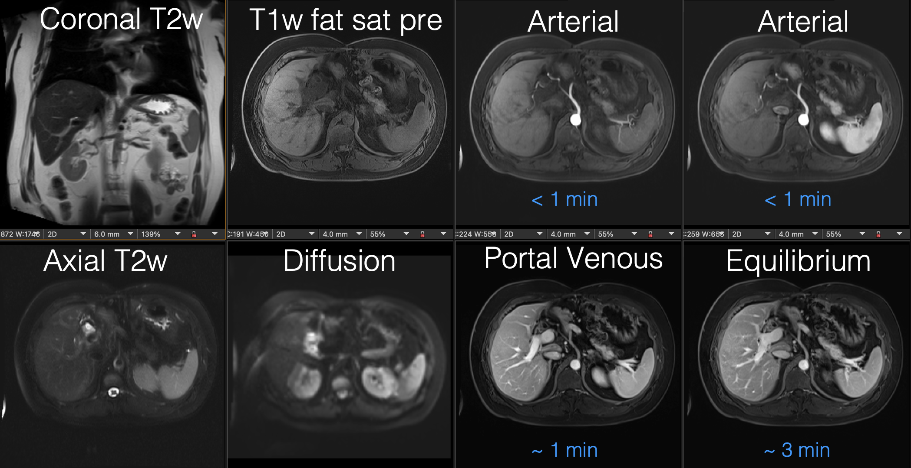

# Duke AIPI590-XAI Fall 2024 Final Project
## Chad Miller 

## Statement of Purpose
This project delivers an interactive Streamlit-based application that classifies abdominal MRI series using convolutional neural networks (CNNs) and integrates explainable AI (XAI) techniques for enhanced interpretability. The app enables users to explore MRI datasets, view model predictions, and generate visual explanations for the decisions made by the model. By utilizing LIME, Anchors, and SHAP, the application allows users to identify the most influential regions in an image, fostering transparency and trust in AI-assisted workflows.


## Background:
Typical abdominal MRI examinations are comprised of numerous imaging series, each containing several images and each with its own set of features that determines tissue contrast. These differences are largely due to differences in acquisition parameters; additionally, several imaging series performed after contrast administration have timing such that the series can be generally characterized as being from a particular phase of post contrast imaging (e.g., ‘arterial’, ‘portal venous’, ‘hepatobiliary phase’, or ‘delayed’). 

Accurate automated series identification of abdominal MRI series is important for applications such as display protocols (or “hanging” protocols) and advanced postprocessing workflows, including radiomics or machine learning. Current approaches, such as textual series descriptions, are often unreliable due to inconsistencies across vendors, protocols, or institutions. Pixel-based classifiers, while promising, can be computationally expensive and may lack sufficient accuracy, whereas metadata-based classifiers struggle to distinguish between series with identical acquisition parameters. 

Note that with respect to ‘hanging’ protocols in PACS, this is typically performed using rules-based processes using the series description text and/or parameter values (T1, T2 settings) and may have problems when encountering data with variation (such as for reviewing a non-Duke study, see Figure 1 below). When the hanging protocol fails and there are several empty panels, this requires that the Radiologist finds them which is less efficient, and may cause him/her to not identify series of images which could lead to missed or incorrect diagnoses. 

Figure 1: On top is a typical PACS display with the hanging protocol for a Duke study, and on the bottom is the hanging of a non-Duke study with several empty panels.

### outside study:


## Approach
This repository uses a CNN-based model, specifically a DenseNet121 architecture, fine-tuned to classify abdominal MRI series into one of 19 distinct classes. This pixel-based classifier processes a single representative image (typically the middle image) from each series to reduce computational overhead, similar to a previously published approach for brain MRI classification [2].

To enhance interpretability and provide insights into model predictions, explainable AI techniques such as LIME, Anchors, and SHAP have been integrated. These methods help users understand the reasoning behind the model’s decisions, improving trust and usability in clinical settings.


## Dataset:
The dataset is identical to that reported in [3] and contains scans from multiple vendors and field strengths, representative of typical clinical abdominal MRI examinations. The dataset includes:

* 2,215 MRI series from 105 subjects, with each subject having a single examination.
* Series manually labeled by three radiologists with 2–15 years of experience.
* A final dataset of 2,165 MRI series after eliminating research-only and uncommon (less than 10 samples) series, split into 80% training (1,733 series) and 20% testing (432 series).
* Each series includes a single representative image, typically the middle image, chosen to avoid artifacts often found at the beginning or end of a series.

## Methods and Results:
### Data Preparation
A single image from each series was selected to create the dataset (particularly, the middle image in a sorted series) rather than the entire dataset as described above. As the image names are sequential within each series, the middle image corresponds to anatomy in the center of the series (midway between top and bottom images in an axial series); choosing the middle image of each series has benefit in that it avoids artifact and poor image quality more frequently found in the first few and last few images of a series. Transfer learning models with common model architectures trained with ImageNet weights were used. Image filenames for the chosen image from each series were stored in .csv files.  A custom dataset class extracted the pixel information using pydicom and dataloaders prepared batches of images (16 typically). Image transformations were applied to the normalized pixel values to produce tensors of the appropriate size and shape. As the original data was in grayscale, the preprocessing included a transformation for conversion to 3 channels.  For data augmentation, care was taken to avoid transformations such as horizontal or vertical flipping which would alter the fundamental semantic meaning of the anatomy. Resizing and center cropping were used, either with or without the addition of color jitter transformations which were added to help reduce overfitting. The model was provided images of dimension Batch x 3 x 229 x 229, appropriate for both the ResNet50 and DenseNet121 architectures.

### Model Architecture:
The initial baseline model was a ResNet50 model with ImageNet weights and replacement of the top layer by a single fully connected layer for the 19 classes. In addition to the baseline model, other architectures that used for transfer learning included a ResNet50 model with a more complicated architecture added as the head consisting of two linear layers with an intervening ReLU layer (labeled as ResNet50b), and DenseNet121. The multilayer classifier head in ResNet50b was explored as it was postulated the additional fully connected layers and the non-linear activations could enable the model to learn more complex representations from the ResNet50 features, potentially important for the classification task. DenseNet architecture, based on the concept of dense blocks consisting of multiple layers connected in a dense manner--with each layer receiving feature maps from all preceding layers--was chosen for the possibility that the the dense connectivity could capture fine-grained details within the medical images. Different optimizers (Adam and SGD) and loss functions (Cross Entropy and Focal Loss) were explored, as well as the use of gamma filters as a preprocessing step. 

### Results:
With the combination of DenseNet121, Adam, Focal Loss, the accuracy on the test dataset is 91%. The confusion matrix is shown below:


## Metadata Classifier
The metadata classifier is a RandomForest model. A grid search is used to tune hyperparameters, and the model is trained on the resultant optimized model. This can be quickly trained on a cpu, and has fairly high accruacy for many of the types of images. It does not, however, do well classifying post contrast series (e.g., portal venous phase, arterial, equilibrium) nor the precontrast series (T1 fat sat) that is performed with identical imaging parameters to the post contrast images. 


## How to install and use the repository code

**Google Colab**

The simplest way to view the code involved in training the models, inference from the models, and visualization of incorrect predictions and Gan-CAM images is through the
## need to update the page

which is located in the notebooks subdirectory of the app directory. 

**Demo**

The streamlit demo displays the ability to scroll through the images of an abdominal MRI examination to get the predicted series for the image, as well as to process an entire studey or group of studys within a folder, writing the labels into the DICOM metadata of the processed files. In order to run the streamlit demo, it is necessary to have the DICOM images of an abdominal MRI examination. The steps to take to run the demo are:

**1. Clone this repository**
```
git clone https://github.com/mille055/AIPI590-XAI.git

```
**2. Install requirements:**
cd into the directory Assignments/MRIseries
```
cd Assignments/MRIseries
pip install -r requirements.txt
```
**3. Change directory to the demo and run the application**
```
cd app
streamlit run demo.py
```
The streamlit demo app will allow one to view images from the sample batch of studies in the default folder in the left sidebar. These images may or may not have labels embedded into the DICOM tags from prior label processing (generally, the prediction will show over the top left aspect of the image if it has been previously processed). One use of the demo app is to select studies to process (one study/patient at a time). This will generate predictions and write them into the DICOM tags by default. If the destination folder selctor is left blank, the default is for the images to be written back to the same folder, overwriting the previously unprocessed study. Other functions in the demo include the ability to get predictions (the fusion model and its subcomponents) for a single image. It is also possible to view a stuby by the series labels (part of the study in the SeriesDescription), or by the predicted class if the study has been previously processed by the classifier. Overall, the goal is to have a pass-through DICOM server that performs the predictions and sends the processed images back to the souce, but this current demo shows proof of concept and provides a user interface to interact with a study of choice. 


## Repository Structure

[View Tree Structure](tree_structure.txt)


## References:
1.	Gauriau R, Bridge C, Chen L, Kitamura F, Tenenholtz NA, Kirsch JE, Andriole KP, Michalski MH, Bizzo BC: Using DICOM Metadata for Radiological Image Series Categorization: a Feasibility Study on Large Clinical Brain MRI Datasets,  Journal of Digital Imaging (2020) 33:747-762.
2.	Zhu Z, Mittendorf A, Shropshire E, Allen B, Miller CM, Bashir MR, Mazurowski MA: 3D Pyramid Pooling Network for Liver MRI Series Classification,   IEEE Trans Pattern Anal Mach Intell. 2020 Oct 28. PMID 33112740.
3.	Cluceru J, Lupo JM, Interian Y, Bove R, Crane JC: Improving the Automatic Classification of Brain MRI Acquisition Contrast with Machine Learning, Journal of Digital Imaging, July 2022.